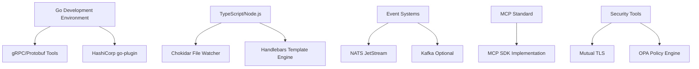
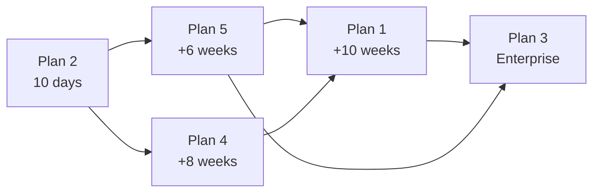

# Implementation Roadmap: OpenCode-SuperClaude Integration

## 🎯 Executive Summary

This roadmap consolidates all five integration approaches into a unified timeline, showing dependencies, resource requirements, and milestone deliverables. It provides strategic guidance for organizations choosing between approaches and planning their implementation journey.

## 📊 Master Timeline Overview

```mermaid
gantt
    title OpenCode-SuperClaude Integration Roadmap
    dateFormat X
    axisFormat %d

    section Plan 2: Quick Integration
    Setup & Dependencies      :done, p2-1, 0, 2d
    Parser & TypeScript       :done, p2-2, after p2-1, 2d
    File Watcher & Live-Reload :done, p2-3, after p2-2, 2d
    OpenCode Integration      :done, p2-4, after p2-3, 2d
    Testing & Optimization    :done, p2-5, after p2-4, 2d

    section Plan 5: Full Implementation
    Foundation & Architecture :p5-1, 0, 7d
    Core Implementation       :p5-2, after p5-1, 14d
    OpenCode Integration      :p5-3, after p5-2, 14d
    Testing & Examples        :p5-4, after p5-3, 7d
    Production Setup          :p5-5, after p5-4, 14d

    section Plan 4: MCP Plugin EDA
    Setup & Proof of Concept  :p4-1, 0, 7d
    Core Development          :p4-2, after p4-1, 21d
    EDA Integration           :p4-3, after p4-2, 14d
    Hardening & Security      :p4-4, after p4-3, 14d

    section Plan 1: Plugin Ecosystem
    RPC Connection Setup      :p1-1, 0, 21d
    Dynamic Plugin System     :p1-2, after p1-1, 21d
    Event System & Hot-Reload :p1-3, after p1-2, 14d
    Security & Developer Kit  :p1-4, after p1-3, 21d

    section Plan 3: Enterprise EDA
    Design & Planning         :p3-1, 0, 42d
    Implementation            :p3-2, after p3-1, 84d
    Testing & Deployment      :p3-3, after p3-2, 70d
```



## 🚀 Plan-by-Plan Implementation Details

### Plan 2: SuperClaude Integration (10 Days)
**Focus**: Rapid MVP for immediate productivity gains

#### Timeline: 10 Working Days
```
Week 1: Days 1-5
├── Days 1-2: Foundation Setup
│   ├── Repository structure setup
│   ├── Dependencies installation (chokidar, gray-matter, marked)
│   └── TypeScript configuration
├── Days 3-4: Core Parser & Types
│   ├── Markdown parser with YAML frontmatter
│   ├── TypeScript type definitions
│   └── Template validation system
└── Day 5: File Watcher Implementation
    ├── Chokidar integration
    ├── Debouncing and stability
    └── Live-reload functionality

Week 2: Days 6-10
├── Days 6-7: OpenCode Integration
│   ├── CLI command structure
│   ├── Context collection system
│   └── Prompt execution pipeline
├── Days 8-9: Testing & Validation
│   ├── Unit tests (90% coverage target)
│   ├── Integration tests
│   └── Performance optimization
└── Day 10: Documentation & Deployment
    ├── Setup scripts
    ├── User documentation
    └── Production deployment
```

**Resource Requirements**:
- **Team**: 3-4 developers (2 TypeScript, 1 Go, 1 testing/DevOps)
- **Budget**: €5,000-8,000 (tools, cloud resources, testing infrastructure)
- **Infrastructure**: Development environments, CI/CD pipeline

**Key Deliverables**:
- ✅ Working prompt broker with hot-reload
- ✅ OpenCode CLI integration (`opencode sc <command>`)
- ✅ Type-safe template system
- ✅ Basic persona support
- ✅ Installation and setup scripts

---

### Plan 5: SuperClaude Implementation (6 Weeks)
**Focus**: Production-ready prompt service with enterprise features

#### Timeline: 42 Days (6 Weeks)
```
Week 1: Foundation & Architecture
├── Project structure and dependencies
├── Core type definitions and schemas
├── Configuration management system
└── Performance monitoring framework

Week 2-3: Core Implementation
├── Advanced markdown parser with validation
├── Intelligent file watcher with fallbacks
├── Template engine with Handlebars
├── Context enrichment and persona system
├── Caching and performance optimization

Week 4-5: OpenCode Integration
├── CLI command integration
├── Context collector service
├── Streaming output support
├── Error handling and recovery
├── Debug and diagnostic tools

Week 6: Production & Monitoring
├── Configuration management
├── Performance monitoring
├── Health checks and metrics
├── Installation automation
├── Comprehensive documentation
```

**Resource Requirements**:
- **Team**: 3-4 developers (2 TypeScript/Go, 1 DevOps, 1 QA)
- **Budget**: €15,000-25,000 (development, testing, monitoring tools)
- **Infrastructure**: Production monitoring, CI/CD, deployment automation

**Key Deliverables**:
- ✅ Enterprise-grade prompt broker
- ✅ Comprehensive monitoring and metrics
- ✅ Advanced error handling and recovery
- ✅ Production deployment automation
- ✅ Complete developer documentation

---

### Plan 4: MCP Plugin EDA Architecture (8 Weeks)
**Focus**: Scalable plugin system with event-driven architecture

#### Timeline: 56 Days (8 Weeks)
```
Week 1: Setup & Proof of Concept
├── ADR documentation and MCP compliance
├── Basic MCP server implementation
├── NATS cluster setup with Docker
└── Initial plugin SDK design

Weeks 2-4: Core Development
├── Host MCP client with retry logic
├── Plugin SDK for Go & TypeScript
├── Event emitter and NATS integration
├── Reference plugin implementation
├── Basic observability setup

Weeks 5-6: EDA Integration
├── Event router with queue groups
├── JetStream persistence layer
├── OpenTelemetry integration
├── Performance optimization
└── Parallel processing capabilities

Weeks 7-8: Hardening & Security
├── Security policies with OPA
├── Chaos engineering tests
├── CI/CD with signed binaries
├── Production deployment
└── Community documentation
```

**Resource Requirements**:
- **Team**: 4-5 developers (3 Go, 1 TypeScript, 1 DevOps/Security)
- **Budget**: €25,000-35,000 (development, security audit, infrastructure)
- **Infrastructure**: NATS cluster, observability stack, security scanning

**Key Deliverables**:
- ✅ Production-ready plugin architecture
- ✅ Event-driven communication system
- ✅ Comprehensive security framework
- ✅ Developer SDK and documentation
- ✅ Observability and monitoring

---

### Plan 1: Plugin Ecosystem Architecture (8-10 Weeks)
**Focus**: Community-driven extensible platform

#### Timeline: 70 Days (10 Weeks)
```
Weeks 1-3: RPC Foundation (21 days)
├── gRPC service definition and protobuf
├── Minimal host program with plugin loading
├── Basic plugin implementation
├── HashiCorp go-plugin integration
└── Process communication validation

Weeks 4-6: Dynamic Plugin System (21 days)
├── Plugin manager service
├── Dynamic plugin discovery and loading
├── Plugin metadata collection
├── Host-manager integration
└── SuperClaude prompt plugin

Weeks 7-8: Event System & Hot-Reload (14 days)
├── NATS messaging integration
├── Event-driven plugin management
├── Hot-reload functionality
├── Control interface implementation
└── Runtime plugin updates

Weeks 9-10: Security & Developer Experience (14 days)
├── Plugin permission model design
├── Comprehensive developer documentation
├── Plugin Developer Kit (PDK)
├── Security audit and validation
└── Community onboarding materials
```

**Resource Requirements**:
- **Team**: 5-8 developers (4 Go, 2 DevOps, 1 Security, 1 Community Manager)
- **Budget**: €40,000-60,000 (development, security, community programs)
- **Infrastructure**: Plugin marketplace, build systems, security scanning

**Key Deliverables**:
- ✅ Complete plugin ecosystem platform
- ✅ Community developer tools and documentation
- ✅ Security-first plugin architecture
- ✅ Plugin marketplace foundation
- ✅ Enterprise-grade process isolation

---

### Plan 3: MCP Bridge + Plugin + EventDriven (4-8 Months)
**Focus**: Enterprise-grade multi-tier architecture

#### Timeline: 196 Days (28 Weeks)
```
Phase 1: Design & Planning (6 weeks)
├── Architecture analysis and MCP bridge design
├── Plugin architecture planning
├── Event-driven setup and framework selection
├── Risk assessment and mitigation planning
└── Team structure and resource allocation

Phase 2: Implementation (12 weeks)
├── MCP Server Bridge development
│   ├── MCP SDK integration
│   ├── Client-server communication
│   └── External MCP server connections
├── Plugin Architecture Development
│   ├── HashiCorp-style plugin system
│   ├── Plugin isolation and management
│   └── Plugin registry and discovery
└── Event-Driven Architecture Integration
    ├── Real-time event system setup
    ├── Event-bridge plugin coordination
    └── Notification and update systems

Phase 3: Testing & Deployment (10 weeks)
├── Comprehensive testing strategy
│   ├── Unit and integration testing
│   ├── Community beta testing
│   └── Performance and security testing
├── Production deployment
│   ├── CI/CD pipeline implementation
│   ├── Monitoring and observability
│   └── Documentation and training
└── Monitoring & Optimization
    ├── Performance monitoring
    ├── User feedback integration
    └── Iterative improvements
```

**Resource Requirements**:
- **Team**: 5-8 developers (3 Go, 2 TypeScript, 2 DevOps, 1 Security)
- **Budget**: €60,000-100,000 (comprehensive development, testing, deployment)
- **Infrastructure**: Enterprise-grade infrastructure, security systems, monitoring

**Key Deliverables**:
- ✅ Complete MCP-compliant bridge system
- ✅ Enterprise plugin architecture
- ✅ Real-time event-driven system
- ✅ Comprehensive testing and monitoring
- ✅ Production deployment and support

---

## 🔄 Dependencies and Prerequisites

### Technical Dependencies


### Resource Dependencies
| Plan | Go Devs | TypeScript Devs | DevOps | Security | Total |
|------|---------|-----------------|--------|----------|-------|
| Plan 2 | 1 | 2 | 1 | 0 | 4 |
| Plan 5 | 2 | 2 | 1 | 0 | 5 |
| Plan 4 | 3 | 1 | 1 | 1 | 6 |
| Plan 1 | 4 | 0 | 2 | 1 | 7 |
| Plan 3 | 3 | 2 | 2 | 1 | 8 |

### Infrastructure Dependencies
- **Development**: Git repositories, CI/CD pipelines, testing environments
- **Messaging**: NATS clusters, Kafka infrastructure (enterprise plans)
- **Security**: Certificate authorities, signing infrastructure, audit tools
- **Monitoring**: Observability stack (Prometheus, Grafana, OpenTelemetry)
- **Documentation**: Wiki systems, API documentation tools

---

## 🎯 Milestones and Deliverables

### Phase Gates
Each plan includes critical phase gates that must be achieved before proceeding:

#### Phase Gate 1: Foundation
- ✅ Development environment setup complete
- ✅ Basic architecture validated with proof-of-concept
- ✅ Team onboarded and productive
- ✅ Critical path dependencies resolved

#### Phase Gate 2: Core Implementation
- ✅ Core functionality implemented and tested
- ✅ Integration points validated
- ✅ Performance benchmarks met
- ✅ Security requirements satisfied

#### Phase Gate 3: Production Readiness
- ✅ Comprehensive testing completed (>90% coverage)
- ✅ Documentation and training materials ready
- ✅ Deployment automation functional
- ✅ Monitoring and alerting operational

### Success Criteria by Plan
| Plan | Primary Success Metric | Secondary Metrics |
|------|------------------------|-------------------|
| Plan 2 | Time to first working integration (<10 days) | User adoption, performance |
| Plan 5 | Feature completeness and reliability | Performance, monitoring coverage |
| Plan 4 | Plugin ecosystem establishment | Event throughput, developer adoption |
| Plan 1 | Community plugin creation | Marketplace activity, security incidents |
| Plan 3 | Enterprise feature compliance | System scalability, integration success |

---

## 🔀 Migration and Evolution Paths

### Progressive Enhancement Strategy


### Migration Considerations
- **Data Compatibility**: Ensure template and configuration compatibility across plans
- **API Stability**: Maintain API compatibility during migrations
- **User Experience**: Minimize disruption during transitions
- **Training**: Provide migration documentation and training materials

### Parallel Implementation Strategy
For organizations requiring immediate productivity while building long-term architecture:

1. **Quick Win Phase**: Deploy Plan 2 immediately (10 days)
2. **Parallel Development**: Build Plan 4 or Plan 5 alongside
3. **Migration Phase**: Transition users with zero downtime
4. **Evolution Phase**: Enhance to Plan 1 or Plan 3 as needed

---

## 📊 Resource Planning and Budget Estimates

### Budget Summary by Plan
| Plan | Development | Infrastructure | Security | Total |
|------|-------------|----------------|----------|-------|
| Plan 2 | €5,000 | €1,000 | €500 | €6,500 |
| Plan 5 | €15,000 | €5,000 | €2,000 | €22,000 |
| Plan 4 | €20,000 | €8,000 | €5,000 | €33,000 |
| Plan 1 | €30,000 | €10,000 | €8,000 | €48,000 |
| Plan 3 | €50,000 | €20,000 | €15,000 | €85,000 |

### Resource Allocation Timeline

```mermaid
gantt
    title Resource Allocation Across Plans
    dateFormat X
    axisFormat %d

    section Development Resources
    Plan 2 (4 devs)        :p2-res, 0, 10d
    Plan 5 (5 devs)        :p5-res, 0, 42d
    Plan 4 (6 devs)        :p4-res, 0, 56d
    Plan 1 (7 devs)        :p1-res, 0, 70d
    Plan 3 (8 devs)        :p3-res, 0, 196d

    section Infrastructure Setup
    Basic Infrastructure   :infra1, 0, 7d
    Production Infrastructure :infra2, after infra1, 21d
    Enterprise Infrastructure :infra3, after infra2, 42d
```


---

## 🚨 Risk Management and Mitigation

### Cross-Plan Risk Assessment
| Risk Category | Probability | Impact | Mitigation Strategy |
|---------------|-------------|--------|-------------------|
| **Technical Complexity** | Medium | High | Start with simpler plans, progressive enhancement |
| **Resource Availability** | High | Medium | Flexible team allocation, contractor backup |
| **Security Vulnerabilities** | Low | High | Security-first design, regular audits |
| **Community Adoption** | Medium | Medium | Early feedback loops, documentation focus |
| **Performance Issues** | Medium | Medium | Continuous benchmarking, optimization sprints |

### Plan-Specific Risks
#### Plan 2 (Quick Integration)
- **Risk**: Technical debt from rapid development
- **Mitigation**: Plan migration path to Plan 5 from start

#### Plan 1 (Plugin Ecosystem)
- **Risk**: Security vulnerabilities in community plugins
- **Mitigation**: Mandatory security review, sandboxing, signed plugins

#### Plan 3 (Enterprise)
- **Risk**: Over-engineering, delayed delivery
- **Mitigation**: Phased delivery, MVP approach within each phase

---

## 📈 Success Metrics and KPIs

### Universal Success Metrics
- **Adoption Rate**: Percentage of OpenCode users utilizing SuperClaude features
- **Performance**: Response times, resource usage, error rates
- **Developer Experience**: Time to first success, documentation quality
- **Community Engagement**: Contributions, feedback, plugin creation

### Plan-Specific KPIs
```yaml
Plan 2 - Quick Integration:
  - Time to deployment: <10 days
  - User onboarding: <30 minutes
  - Performance: <100ms prompt execution

Plan 5 - Full Implementation:
  - Feature completeness: 100% SuperClaude functionality
  - Reliability: 99.9% uptime
  - Monitoring coverage: 100% of critical paths

Plan 4 - MCP Plugin EDA:
  - Plugin ecosystem: 10+ plugins within 3 months
  - Event throughput: >1000 events/second
  - Developer adoption: 50+ plugin developers

Plan 1 - Plugin Ecosystem:
  - Community plugins: 25+ within 6 months
  - Security incidents: 0 critical vulnerabilities
  - Marketplace activity: 100+ downloads/week

Plan 3 - Enterprise:
  - Enterprise features: 100% compliance requirements
  - Scalability: Support 1000+ concurrent users
  - Integration success: 95% successful deployments
```

---

## 🚀 Next Steps and Recommendations

### Immediate Actions (Next 30 Days)
1. **Team Assessment**: Evaluate current team capabilities against plan requirements
2. **Stakeholder Alignment**: Present roadmap to stakeholders for buy-in and resource allocation
3. **Plan Selection**: Choose primary implementation plan based on requirements and constraints
4. **Environment Setup**: Prepare development environments and CI/CD pipelines
5. **Community Engagement**: Begin community communication about integration plans

### Strategic Recommendations
- **For Startups/Small Teams**: Begin with Plan 2, evolve to Plan 5
- **For Growing Organizations**: Start with Plan 5, consider Plan 4 for plugin needs
- **For Enterprise**: Plan long-term with Plan 3, but consider Plan 5 for immediate wins
- **For Open Source Projects**: Plan 1 for maximum community engagement

### Long-term Considerations
- **Ecosystem Evolution**: Monitor MCP standard evolution and community needs
- **Technology Updates**: Stay current with Go, TypeScript, and infrastructure technologies
- **Security Landscape**: Regular security audits and vulnerability assessments
- **Community Feedback**: Continuous integration of user feedback and feature requests

---

## 📚 Additional Resources

- [DECISION-LOG.md](./DECISION-LOG.md) - Architectural decision records
- [PLAN-USAGE-GUIDE.md](./PLAN-USAGE-GUIDE.md) - Plan selection framework
- Individual plan documentation (ARCHITECTURE.md, INTEGRATION.md, etc.)
- [Model Context Protocol Documentation](https://modelcontextprotocol.io/)
- [HashiCorp Plugin System](https://github.com/hashicorp/go-plugin)
- [NATS JetStream Documentation](https://docs.nats.io/jetstream)

---

*This roadmap is a living document that will be updated as implementations progress and new insights are gained. Regular reviews ensure alignment with evolving requirements and community needs.*