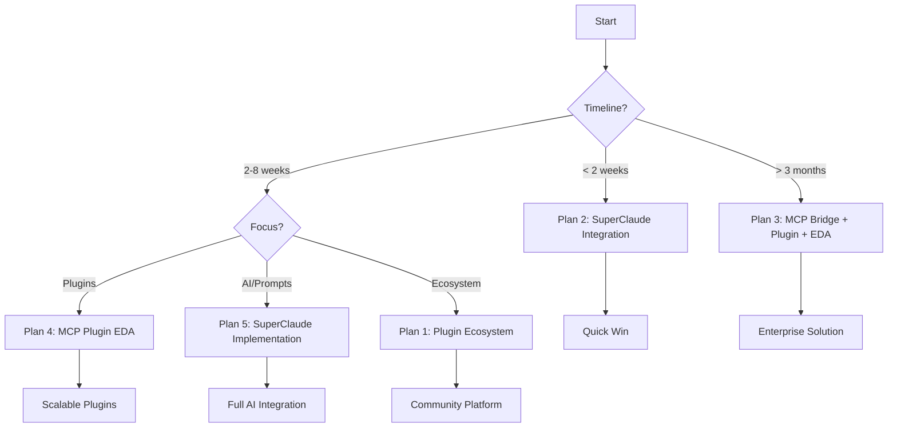

# 📋 OpenCode Integration Plans - Comprehensive Usage Guide

## 🎯 Overview

This guide provides a comprehensive comparison of five distinct integration plans for combining OpenCode with SuperClaude capabilities. Each plan represents a different architectural approach with varying complexity, timelines, and strategic goals.

## 📊 Plan Comparison Matrix

| Plan | Focus | Timeline | Complexity | Team Size | Strategic Value |
|------|-------|----------|------------|-----------|-----------------|
| **[Plugin Ecosystem Architecture](#1-plugin-ecosystem-architecture)** | Extensible platform with community plugins | 8-10 weeks | Very High | 5-8 devs | Transform OpenCode into ecosystem |
| **[SuperClaude Integration](#2-superclaude-integration)** | Direct prompt broker with live-reload | 10 days | Medium | 3-4 devs | Rapid integration of AI capabilities |
| **[MCP Bridge + Plugin + EDA](#3-mcp-bridge-plugin-eventdriven)** | Three-tier architecture with MCP standard | 4-8 months | Very High | 5-8 devs | Enterprise-grade integration |
| **[MCP Plugin EDA Architecture](#4-mcp-plugin-eda-architecture)** | Scalable plugin platform with events | 8 weeks | High | 4-5 devs | Production-ready plugin system |
| **[SuperClaude Implementation](#5-superclaude-implementation)** | Intelligent prompt broker service | 6 weeks | Medium-High | 3-4 devs | Full-featured prompt integration |

## 📚 Individual Plan Details

### 1. Plugin Ecosystem Architecture
**File**: `ARCHITECTURE.md`

**When to Use**:
- ✅ Building a long-term, community-driven ecosystem
- ✅ Need for external developer contributions
- ✅ Enterprise requirements for process isolation
- ✅ Multi-language plugin support is critical

**Key Features**:
- HashiCorp's go-plugin architecture
- Hot-reload capabilities
- Process isolation for security
- Community plugin marketplace vision

**Best For**: Organizations wanting to transform OpenCode into a comprehensive platform with third-party extensions.

### 2. SuperClaude Integration (10-Day Plan)
**File**: `INTEGRATION.md`

**When to Use**:
- ✅ Need rapid integration (under 2 weeks)
- ✅ Focus on prompt management and live-reload
- ✅ TypeScript-first development team
- ✅ Immediate productivity gains required

**Key Features**:
- Live-reload prompt templates
- Type-safe TypeScript implementation
- Persona-aware context adaptation
- Sub-100ms performance targets

**Best For**: Teams needing quick integration of AI capabilities with minimal architectural changes.

### 3. MCP Bridge + Plugin + EventDriven Integration
**File**: `EVENTDRIVEN.md`

**When to Use**:
- ✅ Enterprise-scale deployment required
- ✅ Multiple architectural patterns needed
- ✅ Long-term investment (4-8 months)
- ✅ Standards compliance is critical

**Key Features**:
- Full MCP standard compliance
- Three-tier architecture
- Real-time event capabilities
- Comprehensive risk management

**Best For**: Large organizations requiring robust, standards-compliant integration with multiple architectural patterns.

### 4. MCP Plugin EDA Architecture
**File**: `EDA.md`

**When to Use**:
- ✅ Need production-ready plugin system
- ✅ Event-driven architecture is priority
- ✅ 2-month implementation window
- ✅ Scalability from laptop to cloud

**Key Features**:
- NATS JetStream for events
- Mutual TLS security
- OpenTelemetry observability
- Edge computing ready

**Best For**: Teams building scalable, event-driven plugin systems with strong security requirements.

### 5. SuperClaude Implementation
**File**: `IMPLEMENTATION.md`

**When to Use**:
- ✅ Full-featured prompt integration needed
- ✅ Comprehensive monitoring required
- ✅ 6-week implementation acceptable
- ✅ Enterprise-grade configuration management

**Key Features**:
- Intelligent context collection
- Comprehensive error handling
- Production monitoring
- Declarative template configuration

**Best For**: Organizations wanting complete SuperClaude integration with enterprise features.

## 🚦 Decision Framework

### Quick Start (< 2 weeks)
→ Choose **Plan 2** (SuperClaude Integration)

### Plugin Ecosystem Focus
→ Choose **Plan 1** (Plugin Ecosystem) for community-driven
→ Choose **Plan 4** (MCP Plugin EDA) for internal plugins

### Enterprise Requirements
→ Choose **Plan 3** (MCP Bridge + Plugin + EDA) for maximum flexibility
→ Choose **Plan 5** (SuperClaude Implementation) for AI-focused enterprise

### Event-Driven Architecture
→ Choose **Plan 3** or **Plan 4** based on timeline and complexity needs

## 🔄 Migration Paths

### Progressive Enhancement Strategy
1. **Start with Plan 2** for immediate benefits (10 days)
2. **Migrate to Plan 5** for full features (6 weeks)
3. **Evolve to Plan 1 or 4** for plugin ecosystem (2-3 months)
4. **Ultimate: Plan 3** for complete enterprise architecture

### Parallel Implementation
- Run **Plan 2** for immediate productivity
- While building **Plan 4** for long-term architecture
- Use learnings from both for eventual **Plan 3** implementation

## ⚡ Quick Selection Guide

## 📋 Implementation Checklist

Before choosing a plan, consider:

- [ ] Available timeline and resources
- [ ] Team expertise (Go vs TypeScript)
- [ ] Scalability requirements
- [ ] Community involvement needs
- [ ] Enterprise feature requirements
- [ ] Event-driven architecture needs
- [ ] Standards compliance (MCP)
- [ ] Security and isolation requirements

## 🎯 Recommendation Summary

- **For Startups**: Begin with Plan 2, evolve to Plan 5
- **For Enterprises**: Start with Plan 5, consider Plan 3 for full architecture
- **For Open Source Projects**: Plan 1 for community ecosystem
- **For Technical Teams**: Plan 4 for clean plugin architecture
- **For Maximum Flexibility**: Plan 3 with phased implementation

## 📞 Next Steps

1. Review team capabilities against plan requirements
2. Assess timeline constraints and budget
3. Consider long-term architectural goals
4. Choose primary plan with potential migration path
5. Begin with proof-of-concept from selected plan

---

*Note: Plans can be combined or implemented in phases. Consider starting with a simpler plan and migrating to more complex architectures as requirements evolve.*