### Umfassender Umsetzungsplan: Prompt-Broker + File Watcher + TypeScript-Module  
**Ziel**: Integration in 10 Arbeitstagen mit Live-Reload, Typsicherheit und nahtloser OpenCode-Einbindung  

---

#### 📅 Tag 1-2: Grundgerüst & Abhängigkeiten  
| **Task** | **Technische Umsetzung** | **Output** |
|----------|---------------------------|------------|
| **1. Repo-Struktur anpassen** | `mkdir src/superclaude` <br> `touch src/superclaude/{broker,watcher,types}.ts` | Ordnerstruktur für Integration |
| **2. Abhängigkeiten installieren** | `npm install chokidar js-yaml remark @types/mdorganizer` | `package.json` aktualisiert |
| **3. TypeScript-Konfiguration** | `tsconfig.json`: <br> `"paths": { "@superclaude/*": ["./src/superclaude/*"] }` | Modul-Auflösung eingerichtet |

---

#### 📅 Tag 3-4: Markdown-Parser & Typsicherheit  
| **Task** | **Technische Umsetzung** | **Output** |
|----------|---------------------------|------------|
| **1. Frontmatter-Parser** | ```typescript
// src/superclaude/parser.ts
import * as yaml from 'js-yaml';
import { remark } from 'remark';
import remarkFrontmatter from 'remark-frontmatter';

export const parseMarkdown = (content: string) => {
  let frontmatter: Record<string, any> = {};
  let template = '';

  remark()
    .use(remarkFrontmatter, ['yaml'])
    .use(() => (tree: any) => {
      tree.children.forEach((node: any) => {
        if (node.type === 'yaml') {
          frontmatter = yaml.load(node.value) as Record<string, any>;
        } else {
          template += node.value;
        }
      });
    })
    .processSync(content);

  return { frontmatter, template };
};
``` | Markdown → {frontmatter, template} |
| **2. Typgenerierung mit mdorganizer** | `scripts/generate-types.ts`: <br> ```typescript
import { generate } from 'mdorganizer';

generate({
  inputDir: './superclaude/prompts',
  outputFile: './src/superclaude/prompt-types.d.ts',
  schema: {
    requires: 'string[]',
    personas: 'string[]'
  }
});
``` | `prompt-types.d.ts` mit TS-Interfaces |

---

#### 📅 Tag 5-6: File Watcher & Live-Reload  
| **Task** | **Technische Umsetzung** | **Output** |
|----------|---------------------------|------------|
| **1. Chokidar-Watcher** | ```typescript
// src/superclaude/watcher.ts
import chokidar from 'chokidar';
import { parseMarkdown } from './parser';
import { PromptBroker } from './broker';

export const startWatching = (dir: string, broker: PromptBroker) => {
  const watcher = chokidar.watch(dir, {
    ignored: /(^|[/\\])\../,
    persistent: true,
    ignoreInitial: false,
    awaitWriteFinish: { stabilityThreshold: 500 }
  });

  watcher
    .on('add', (path) => handleUpdate(path, broker))
    .on('change', (path) => handleUpdate(path, broker))
    .on('unlink', (path) => broker.removeTemplate(path));
};

const handleUpdate = async (path: string, broker: PromptBroker) => {
  const content = await fs.promises.readFile(path, 'utf-8');
  const { frontmatter, template } = parseMarkdown(content);
  broker.updateTemplate(path, { ...frontmatter, template });
};
``` | Live-Änderungsdetektion |
| **2. Fallback-Polling** | ```typescript
// Zusätzlich in startWatching
setInterval(() => {
  const files = fs.readdirSync(dir);
  files.forEach(file => {
    const stats = fs.statSync(`${dir}/${file}`);
    if (stats.mtimeMs > lastCheck) handleUpdate(`${dir}/${file}`, broker);
  });
}, 300_000); // 5min Fallback
``` | Redundanz für Edge Cases |

---

#### 📅 Tag 7-8: Prompt-Broker & OpenCode-Integration  
| **Task** | **Technische Umsetzung** | **Output** |
|----------|---------------------------|------------|
| **1. Broker-Kernlogik** | ```typescript
// src/superclaude/broker.ts
import { PromptTemplate } from './types';

export class PromptBroker {
  private templates = new Map<string, PromptTemplate>();

  updateTemplate(path: string, template: PromptTemplate) {
    const key = path.split('/').pop()!.replace('.md', '');
    this.templates.set(key, template);
  }

  removeTemplate(path: string) {
    const key = path.split('/').pop()!.replace('.md', '');
    this.templates.delete(key);
  }

  execute(command: string, context: Record<string, string>) {
    const template = this.templates.get(command);
    if (!template) throw new Error(`Unknown command: ${command}`);
    
    // Validierung
    template.requires?.forEach(req => {
      if (!context[req]) throw new Error(`Missing ${req} in context`);
    });

    // Rendering
    return template.template.replace(
      /{{(\w+)}}/g, 
      (_, key) => context[key] || ''
    );
  }
}
``` | Template-Verwaltung + Rendering |
| **2. OpenCode-Hook** | ```typescript
// src/opencode/commands.ts
import { PromptBroker } from '@superclaude/broker';
import { startWatching } from '@superclaude/watcher';

const broker = new PromptBroker();
startWatching('./superclaude/prompts', broker);

export const registerSuperClaude = (cli: CLI) => {
  cli.command('sc <command>')
    .option('--persona <type>', 'Set persona profile')
    .action(async (command, options) => {
      const context = gatherContext(); // Holen von Code-Kontext
      if (options.persona) {
        context.persona = personas[options.persona]; 
      }
      const prompt = broker.execute(command, context);
      const response = await aiClient.send(prompt);
      renderResponse(response);
    });
};
``` | `/sc explain --persona security` |

---

#### 📅 Tag 9-10: Testing & Optimierung  
| **Task** | **Technische Umsetzung** | **Output** |
|----------|---------------------------|------------|
| **1. Jest-Tests** | ```typescript
// tests/broker.test.ts
test('renders explain template correctly', () => {
  broker.updateTemplate('explain.md', {
    requires: ['selectedCode'],
    template: 'Explain: {{selectedCode}}'
  });
  
  const result = broker.execute('explain', {
    selectedCode: 'const x = 10;'
  });
  
  expect(result).toBe('Explain: const x = 10;');
});
``` | 90% Testabdeckung |
| **2. Performance-Check** | `console.time('broker');` <br> `broker.execute(...);` <br> `console.timeEnd('broker');` | < 50ms/Execution |
| **3. DevEx-Verbesserung** | ```typescript
// Hot-Reload-Notification
watcher.on('change', path => {
  ui.notify(`♻️ Updated: ${path.split('/').pop()}`);
});
``` | Visuelles Live-Feedback |

---

#### 🔧 Technisches Stack-Diagramm  

```mermaid
graph LR
  A[Markdown-Dateien] --> B(File Watcher)
  B --> C[Parser]
  C --> D[PromptBroker]
  D --> E[OpenCode CLI]
  F[TypeScript Generierung] -.-> D
  E --> G[AI-Client]
  G --> H[Response Rendering]
  
  subgraph Legend
    I[Grün: Live-Update] 
    J[Blau: Statische Komponente]
  end
```


#### ✅ Qualitätssicherungsmaßnahmen  
1. **Linting**: ESLint mit TypeScript-spezifischen Regeln  
2. **Type-Check**: `tsc --noEmit` im CI-Pipeline  
3. **E2E-Tests**: Playwright für CLI-Interaktionen  
4. **Sicherheit**: Sandboxing mit `vm2` für Template-Rendering  

#### 📈 Metriken für den Erfolg  
| **Metrik** | **Zielwert** | **Messmethode** |
|------------|--------------|-----------------|
| Ladezeit Prompts | < 100ms | `console.time` |
| DevEx-Score | > 4.5/5 | Umfrage (10 Devs) |
| Fehlerrate | < 0.5% | Sentry-Logging |
| TTI (Time-to-Integrate) | < 1h | Onboarding-Test |

> **Hinweis**: Die Lösung ist ab Tag 8 produktiv einsetzbar - weitere Tage dienen der Optimierung. Bei Problemen priorisieren: 1) Typsicherheit 2) Live-Reload 3) Performance.
